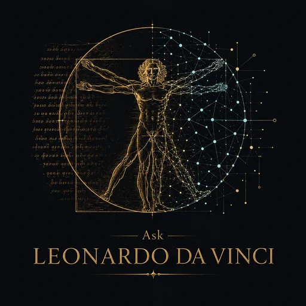
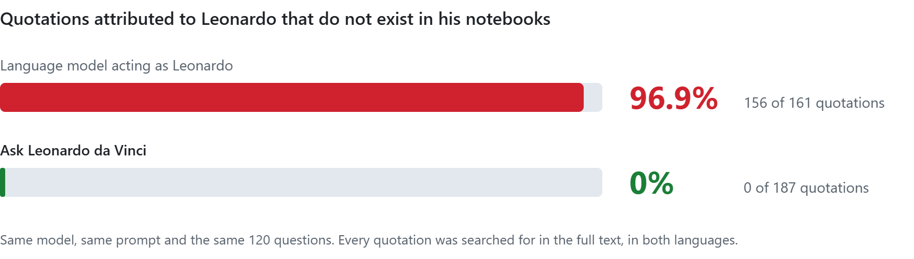
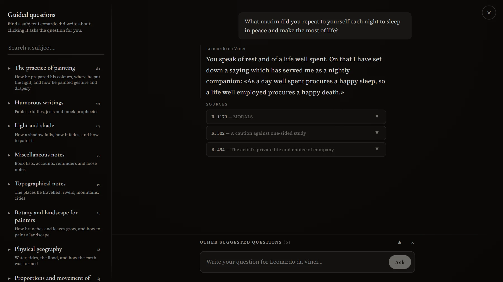
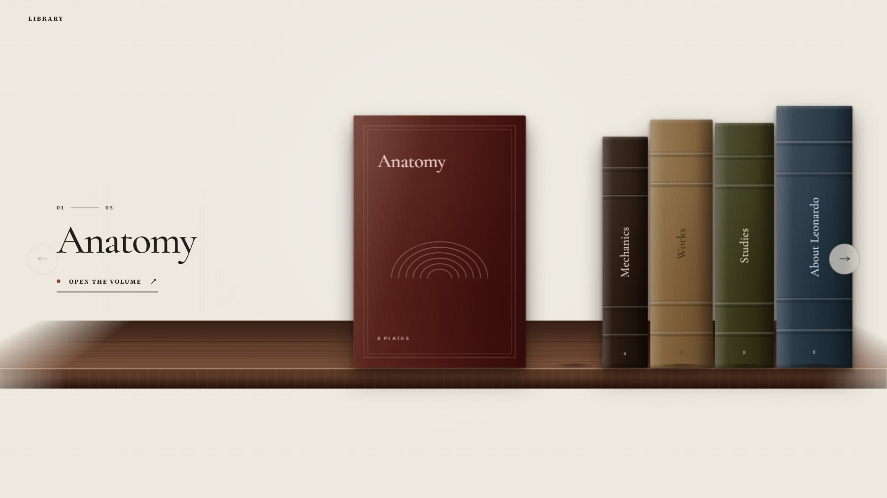
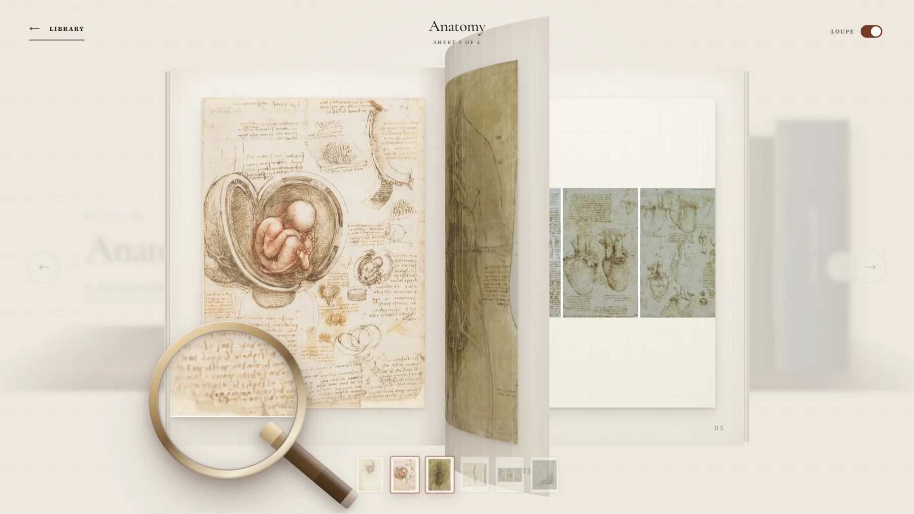
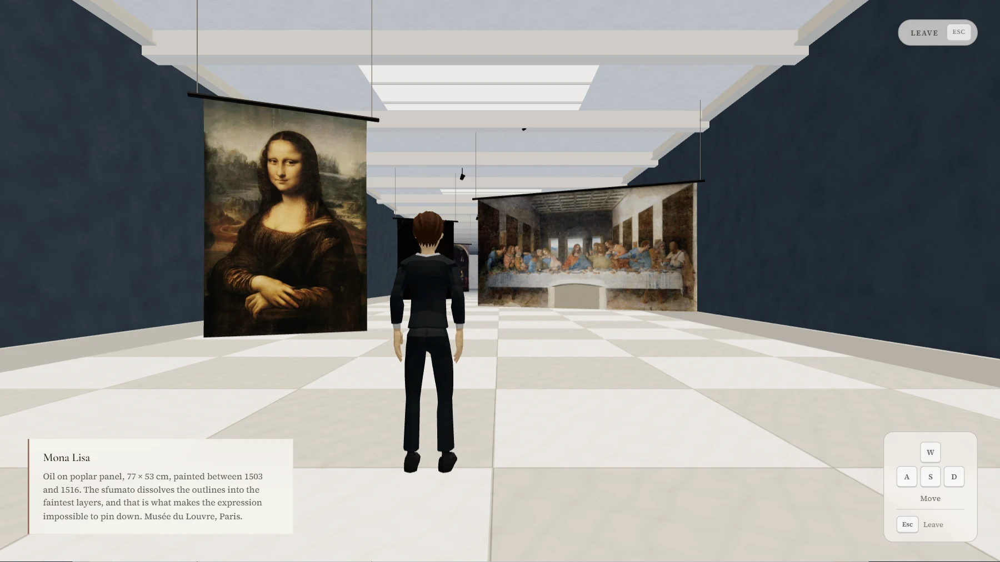
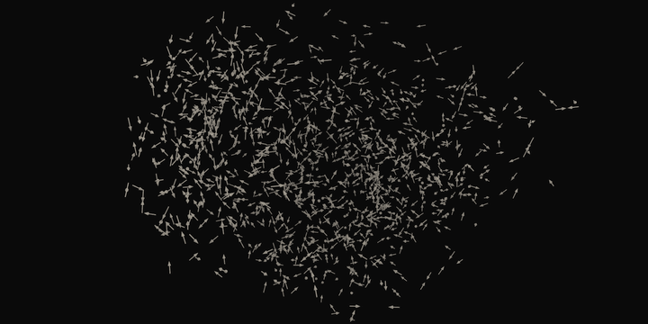

[Español](README.md) | [English](README.en.md)

<p align="center">
  
</p>

<h1 align="center">Ask Leonardo da Vinci</h1>

<p align="center">
  <strong>Leonardo da Vinci left more than 7,500 written pages.</strong><br>
  For the first time, software uses them to speak with him without inventing answers.
</p>

<p align="center">
  🌐 <a href="https://www.askleonardodavinci.online/en"><strong>askleonardodavinci.online</strong></a> (EN / ES)
</p>

---

## 💡 The idea

The project comes from putting two facts together.

**The limit of AI.** A language model that simulates a real person does it in a generic, unconvincing way: it makes up even the way they express themselves, which says a lot about who someone is, and it attributes to them phrases, opinions and facts they never said. For a conversation with such an AI to make sense, that person would have had to leave behind an enormous written context of themselves (thousands of questions, answers and reflections), so that the AI would have the information it needed and would not have to make things up. Almost nobody has anything like that.

**The fact about Leonardo.** Leonardo did. Throughout his life he made a kind of *mind transfusion onto paper*: he wrote down what he observed, what he tested and what he wondered about, from anatomy and optics to painting, machines, fables and even his shopping lists. More than 7,500 pages survive. In 1888, Jean Paul Richter transcribed and translated 1,565 of his passages in an edition now in the public domain: that is the text the system searches.

**The project.** Putting the two facts together was the starting point, not the result. It took measuring and choosing models, calibrating the semantic search, separating Leonardo's voice from his editor's, reining in the model's prose and checking that every quotation exists in the notebooks. The result is software that does not need to imagine how Leonardo would answer, because it looks it up in what he wrote, and that comes as close as is possible today to feeling you can ask him in person.

The difference can be measured:

<picture>
  <source media="(prefers-color-scheme: dark)" srcset=".github/readme/resultado-en-oscuro.png">
  
</picture>

---

## 🎯 Features

### Ask Leonardo

<p align="center">
  
</p>

- **Answers with sources.** Leonardo answers in the first person from the retrieved passages, with the sources underneath and a link to each passage on Project Gutenberg.
- **Verbatim quotations.** What appears in quotation marks comes word for word from the original passage; if it does not match, it is not shown as a quotation.
- **Guided questions.** Visitors usually do not know what they can ask Leonardo. A map of 22 sections and 396 subjects he did write about, plus six suggested questions, shows it in seconds, including subjects that probably would not occur to them. Any subject becomes a question in one click, which lets people who are not used to AI focus on reading the answers instead of crafting a prompt.
- **Wikipedia for plain facts.** It is common for the first thing a visitor thinks of asking to be a fact ("what day were you born?", "who was your master?"), something Leonardo did not usually write down about himself. In those cases the site makes clear that it is not in his notebooks and shows the exact Wikipedia excerpt, with its attribution, so the visitor gets an answer, but outside Leonardo's voice.
- **Says when there is no answer.** If the notebooks do not cover a subject, it says so instead of making something up: asked about the Mona Lisa, it shows the editor's note confirming that his manuscripts never mention it.
- **Bilingual.** The whole site, Leonardo's answers included, is fully available in English and Spanish.

### 3D Library

<p align="center">
  
  
</p>

Five volumes with 27 plates by Leonardo. The volumes come off the shelf, leaves turn with the curl of a real book and, on desktop, a loupe lets you read the handwriting up close.

### 3D Virtual museum

<p align="center">
  
</p>

A gallery you walk through, on mobile too, with nine of his works and a label for each one.

### Vector space

It is the site's "How it works" section. It shows visitors the passages turned into vectors and how a question finds its own, and from there it opens "The why and the how of the project". It sits in a website for the general public on purpose: the technical soundness of the system is what backs every answer from Leonardo. You can rotate it, move through it and light up any of its 22 sections.

<p align="center">
  <a href="https://www.askleonardodavinci.online/en#espacio">
    
  </a>
</p>

<p align="center">
  <em>This is not an illustrative animation. These are the project's real vectors: the 1,402 passages the system searches, placed by its neural network and brought down from 384 dimensions to 3 so they can be seen. Each one points to the passage most similar to it.</em><br>
  <a href="https://www.askleonardodavinci.online/en#espacio">Explore it in 3D</a>
</p>

---

## 🏗️ Architecture

A RAG pipeline written from scratch: retrieval, the filter and quotation checking are the project's own code, with no frameworks such as LangChain or LlamaIndex. This way, every step can be controlled and measured on its own. The principle behind the design: **asking a model not to make things up is a hope; checking it in code is a guarantee.** Everything that can be decided without the model is decided before calling it, and whatever depends on the model is never the only line of defence.

```text
Question
  ↓  embedding in the browser, no API
Layer 0 · curated cases ────────────► refusal with cited evidence
  ↓
Layer 1 · similarity vs threshold ──► refusal, without calling the model
  ↓
Hybrid retrieval · cosine + BM25, RRF fusion → 3 passages
  ↓
Layer 2 · the model answers or declines, with the passages in front of it
  ↓
Layer 3 · every quotation verified against the original passage
  ↓
Verified answer + sources
```

- **Cosine decides, fusion only orders.** A ranking always has a first place, whether or not relevant material exists; what determines whether there is an answer is similarity against a calibrated threshold.
- **One index and one threshold per language.** With a shared threshold, the filter's accuracy dropped from 88.4% to 70.5%.
- **Embeddings in the browser.** The query is vectorised on the user's device: no cost per query and no quota that can run out.
- **Operating cost: US$0.** No persistent server and no vector database. The index is an int8 binary versioned in Git, BM25 is precomputed, and the 3D sections load only when someone visits them.

---

## 🛠️ Tech Stack

| Layer | Technology |
|------|------------|
| **Frontend** | Next.js 16 (App Router), React 19, TypeScript, Three.js |
| **Embeddings** | `multilingual-e5-small` (384 dimensions, int8) · Transformers.js in the browser |
| **Retrieval** | Dense cosine + precomputed BM25, RRF fusion |
| **Generation** | Gemini 3.1 Flash-Lite, with GPT-OSS 120B on Groq as fallback |
| **Ingestion** | Python: parsing the Gutenberg edition, voice separation, chunking, embeddings and calibration |
| **Evaluation** | 170 questions across 8 categories · automated judge validated against human labelling |
| **Security** | Cloudflare Turnstile, hashed-IP rate limiting and a global daily budget |
| **Hosting & CI** | Vercel · GitHub Actions |

---

## 📊 Results

| Metric | Result |
|---|---|
| Invented quotations | **0** of 187 |
| Quotations identical to the original passage | **100%** |
| Questions answerable from the notebooks that the system wrongly declined | **0**, across 170 test questions |
| Notebook subjects the search finds in both languages | **94%** |

The two runs behind the chart, with every answer in full, are published in [`evals/out/`](evals/out/).

---

## ⚖️ License

Code under **MIT**. Richter's translation is in the public domain, and [LICENSE-CORPUS.md](LICENSE-CORPUS.md) details the provenance and terms of every third-party material.

---

## 📝 Development Notes

Development leaned heavily on AI throughout the whole cycle: as an engine to speed up production and as a second opinion on technical decisions. The idea, the product decisions and the evaluation criteria (what gets measured, against what, and what gets published) are my own. The full project documentation, which records every decision and the development process, is available privately on request.

---

## 👤 Author

**Iván Gómez Dell'Osa**

- Email: [ivangomezdellosa@gmail.com](mailto:ivangomezdellosa@gmail.com)
- LinkedIn: [linkedin.com/in/ivangomezdellosa](https://www.linkedin.com/in/ivangomezdellosa/)
- GitHub: [IvanGomezDellOsa](https://github.com/IvanGomezDellOsa)
