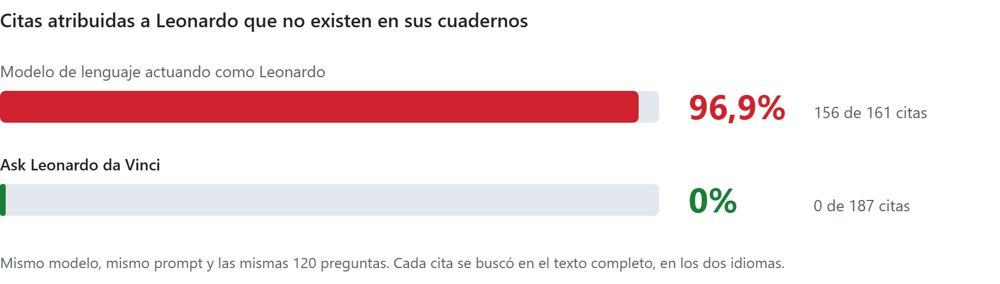
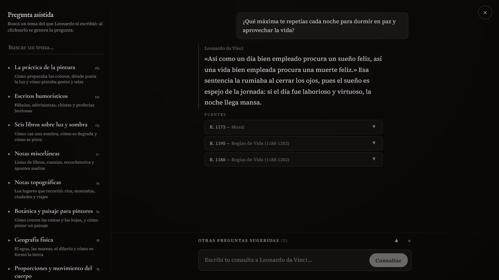
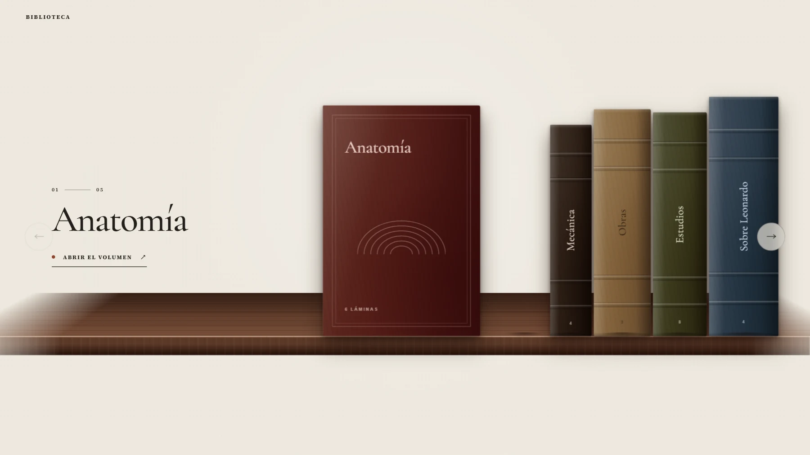
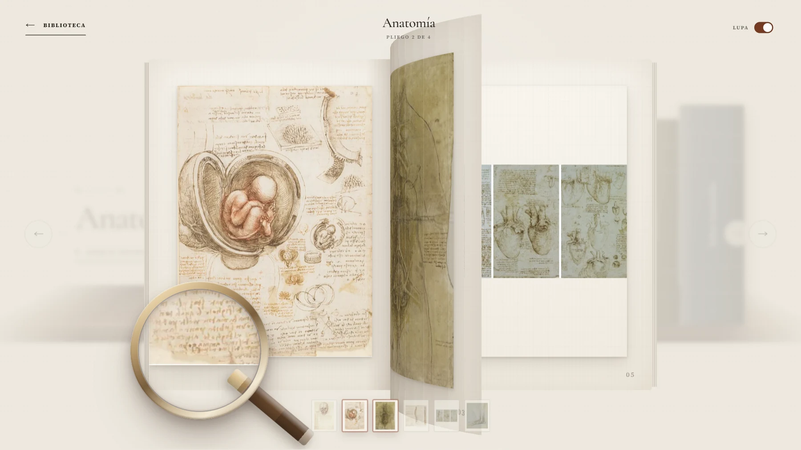
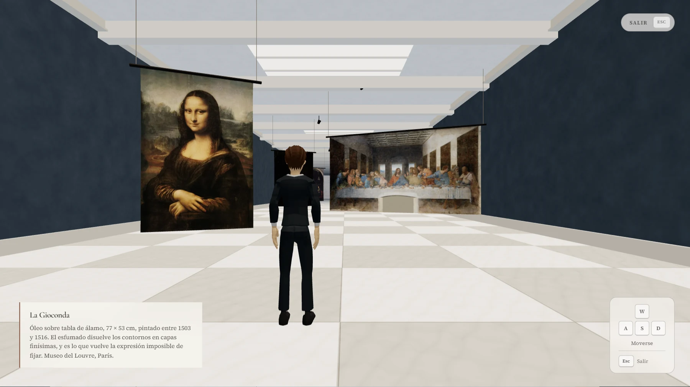

[Español](README.md) | [English](README.en.md)

<p align="center">
  
</p>

<h1 align="center">Ask Leonardo da Vinci</h1>

<p align="center">
  <strong>Leonardo da Vinci dejó más de 7.500 páginas escritas.</strong><br>
  Por primera vez, un software las utiliza para conversar con él sin inventar respuestas.
</p>

<p align="center">
  🌐 <a href="https://www.askleonardodavinci.online"><strong>askleonardodavinci.online</strong></a> (ES / EN)
</p>

---

## 💡 La idea

El proyecto nace de cruzar dos datos.

**El límite de la IA.** Un modelo de lenguaje que simula ser una persona real lo hace de forma genérica y poco lograda: inventa hasta su manera de expresarse, que dice mucho de cómo es alguien, y le atribuye frases, opiniones y datos que nunca dijo. Para que conversar con una IA así tuviera sentido, esa persona tendría que haber dejado por escrito un contexto enorme de sí misma (miles de preguntas, respuestas y reflexiones), de modo que la IA tuviera la información necesaria y no necesitara inventar. Casi nadie tiene algo así.

**El dato sobre Leonardo.** Leonardo sí lo dejó. Durante toda su vida hizo una especie de *transfusión mental a papel*: anotó lo que observaba, lo que experimentaba y lo que se preguntaba, de la anatomía y la óptica a la pintura, las máquinas, las fábulas y hasta sus listas de compras. Sobreviven más de 7.500 páginas. En 1888, Jean Paul Richter transcribió y tradujo 1.565 de sus pasajes en una edición hoy de dominio público: ese es el texto que consulta el sistema.

**El proyecto.** Cruzar los dos datos fue el punto de partida, no el resultado. Hubo que medir y elegir modelos, calibrar la búsqueda semántica, separar la voz de Leonardo de la de su editor, acotar la prosa del modelo y comprobar que cada cita exista en los cuadernos. El resultado es un software que no necesita imaginar cómo respondería Leonardo, porque lo busca en lo que él escribió, y que llega lo más cerca posible, hoy, a sentir que se le puede preguntar en persona.

La diferencia se mide:

<picture>
  <source media="(prefers-color-scheme: dark)" srcset=".github/readme/resultado-es-oscuro.png">
  
</picture>

---

## 🎯 Funcionalidades

### Preguntarle a Leonardo

<p align="center">
  
</p>

- **Respuestas con fuentes.** Leonardo responde en primera persona a partir de los pasajes recuperados, con las fuentes debajo y el enlace a cada pasaje en Project Gutenberg.
- **Citas textuales.** Lo que va entre comillas sale tal cual del pasaje original; si no coincide, no se muestra como cita.
- **Pregunta asistida.** Quien llega no suele saber qué se le puede preguntar a Leonardo. Un mapa de 22 secciones y 396 temas sobre los que sí escribió, más seis preguntas sugeridas, lo muestra en segundos, incluidos temas que probablemente no se le ocurrirían. Cada tema se convierte en pregunta con un clic, por lo que quien no está acostumbrado a la IA puede concentrarse en leer las respuestas en vez de armar un prompt.
- **Wikipedia para los datos puntuales.** Es habitual que lo primero que se le ocurra preguntar a un usuario sea un dato («¿qué día naciste?», «¿quién fue tu maestro?»), algo que Leonardo no solía anotar sobre sí mismo. En esos casos, el sitio aclara que no está en sus cuadernos y muestra el fragmento exacto de Wikipedia, con su atribución, para que el usuario tenga su respuesta, pero fuera de la voz de Leonardo.
- **Dice cuándo no hay respuesta.** Si los cuadernos no tratan un tema, lo dice en lugar de inventar: preguntado por la Mona Lisa, muestra la nota del editor que confirma que sus manuscritos nunca la mencionan.
- **Bilingüe.** Todo el sitio, incluidas las respuestas de Leonardo, está completo en español y en inglés.

### Biblioteca 3D

<p align="center">
  
  
</p>

Cinco volúmenes con 27 láminas de Leonardo. Los tomos salen del estante, las hojas se pasan con el pliegue de un libro real y, en escritorio, una lupa permite leer la escritura de cerca.

### Museo virtual 3D

<p align="center">
  
</p>

Una sala que se recorre caminando, también desde el teléfono, con nueve de sus obras y la ficha de cada una.

### Espacio vectorial

Es la sección «Cómo funciona» del sitio. Le muestra al visitante los pasajes convertidos en vectores y cómo una pregunta encuentra los suyos, y desde ahí se abre «El porqué y el cómo del proyecto». Está en una web para público general a propósito: la validez técnica del sistema es lo que respalda cada respuesta de Leonardo. Se puede girar, recorrer por dentro y encender cualquiera de sus 22 secciones.

<p align="center">
  <a href="https://www.askleonardodavinci.online/#espacio">
    
  </a>
</p>

<p align="center">
  <em>No es una animación ilustrativa. Son los vectores reales del proyecto: los 1.402 pasajes que consulta el sistema, ubicados por su red neuronal y llevados de 384 dimensiones a 3 para poder verlos. Cada uno apunta al pasaje que más se le parece.</em><br>
  <a href="https://www.askleonardodavinci.online/#espacio">Explorarlo en 3D</a>
</p>

---

## 🏗️ Arquitectura

Pipeline RAG escrito desde cero: la recuperación, el filtro y la verificación de citas son código propio, sin frameworks como LangChain o LlamaIndex. De esta forma, cada paso se puede controlar y medir por separado. El principio que ordena el diseño: **pedirle a un modelo que no invente es una esperanza; comprobarlo por código es una garantía.** Todo lo que puede decidirse sin el modelo se decide antes de llamarlo, y lo que depende del modelo nunca es la única defensa.

```text
Pregunta
  ↓  embedding en el navegador, sin API
Capa 0 · casos curados ─────────────► abstención con evidencia citada
  ↓
Capa 1 · similitud contra umbral ───► abstención, sin llamar al modelo
  ↓
Recuperación híbrida · coseno + BM25, fusión RRF → 3 pasajes
  ↓
Capa 2 · el modelo responde o se abstiene, con los pasajes delante
  ↓
Capa 3 · cada cita verificada contra el pasaje original
  ↓
Respuesta verificada + fuentes
```

- **El coseno decide y la fusión sólo ordena.** Un ranking siempre tiene un primer puesto, exista o no material pertinente; lo que determina si hay respuesta es la similitud contra un umbral calibrado.
- **Un índice y un umbral por idioma.** Con un umbral compartido, la exactitud del filtro caía de 88,4% a 70,5%.
- **Embeddings en el navegador.** La consulta se vectoriza en el dispositivo del usuario: sin costo por consulta y sin una cuota que se pueda agotar.
- **Costo de operación: US$0.** Sin servidor persistente ni base de datos vectorial. El índice es un binario int8 versionado en Git, BM25 está precomputado y las secciones 3D se cargan sólo cuando alguien las visita.

---

## 🛠️ Stack Tecnológico

| Capa | Tecnología |
|------|------------|
| **Frontend** | Next.js 16 (App Router), React 19, TypeScript, Three.js |
| **Embeddings** | `multilingual-e5-small` (384 dimensiones, int8) · Transformers.js en el navegador |
| **Recuperación** | Coseno denso + BM25 precomputado, fusión RRF |
| **Generación** | Gemini 3.1 Flash-Lite, con GPT-OSS 120B en Groq como respaldo |
| **Ingesta** | Python: parseo de la edición de Gutenberg, separación de voces, chunking, embeddings y calibración |
| **Evaluación** | 170 preguntas en 8 categorías · juez automático validado contra etiquetado humano |
| **Seguridad** | Cloudflare Turnstile, límite por IP hasheada y presupuesto diario global |
| **Hosting y CI** | Vercel · GitHub Actions |

---

## 📊 Resultados

| Métrica | Resultado |
|---|---|
| Citas inventadas | **0** de 187 |
| Citas idénticas al pasaje original | **100%** |
| Preguntas con respuesta en los cuadernos que el sistema rechazó por error | **0**, en 170 preguntas de prueba |
| Temas de los cuadernos que el buscador encuentra en los dos idiomas | **94%** |

Las dos corridas del gráfico, con cada respuesta completa, están publicadas en [`evals/out/`](evals/out/).

---

## ⚖️ Licencia

Código bajo **MIT**. La traducción de Richter es de dominio público, y [LICENSE-CORPUS.md](LICENSE-CORPUS.md) detalla la procedencia y los términos de cada material de terceros.

---

## 📝 Notas de Desarrollo

Desarrollo apoyado fuertemente en IA a lo largo de todo el ciclo: como motor para acelerar la producción y como segunda opinión ante decisiones técnicas. La idea, las decisiones de producto y el criterio de evaluación (qué se mide, contra qué y qué se publica) son propios. La documentación completa del proyecto, que registra cada decisión y todo el proceso de desarrollo, puede solicitarse por privado.

---

## 👤 Autor

**Iván Gómez Dell'Osa**

- Email: [ivangomezdellosa@gmail.com](mailto:ivangomezdellosa@gmail.com)
- LinkedIn: [linkedin.com/in/ivangomezdellosa](https://www.linkedin.com/in/ivangomezdellosa/)
- GitHub: [IvanGomezDellOsa](https://github.com/IvanGomezDellOsa)
